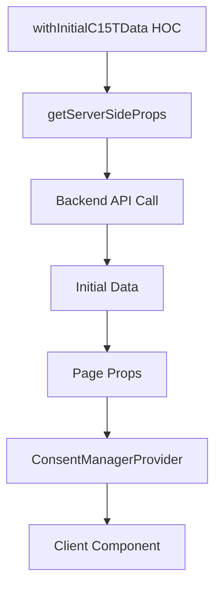

## Overview

The Next.js package provides specialized utilities for working with server components in the App Router architecture.

## Exports

All React hooks and components are re-exported from `@c15t/react` with Next.js-specific enhancements:

```tsx
import {
  useConsent,
  useConsentManager,
  ConsentGate,
  ConsentDialog,
  // ... all React exports
} from '@c15t/nextjs';
```

## Server-Side HOC

### withInitialC15TData

A higher-order component (HOC) for Pages Router that fetches initial consent data on the server.

<Note>
This HOC is only needed for the Pages Router. App Router handles this automatically via the `ConsentManagerProvider`.
</Note>

#### Import

```tsx
import { withInitialC15TData } from '@c15t/nextjs/pages';
```

#### Type Signature

```typescript
function withInitialC15TData<P extends object>(
  Component: NextPage<P>,
  backendURL: string
): NextPage<P & { initialData: InitialDataPromise }>
```

#### Parameters

<ParamField path="Component" type="NextPage<P>" required>
  The Next.js page component to wrap.
</ParamField>

<ParamField path="backendURL" type="string" required>
  The URL of the c15t backend API endpoint.
</ParamField>

#### Returns

<ResponseField name="WrappedComponent" type="NextPage<P & { initialData }>">
  A new page component with initial consent data injected via `getServerSideProps`.
</ResponseField>

#### Usage

```tsx pages/index.tsx
import { withInitialC15TData } from '@c15t/nextjs/pages';
import type { NextPage } from 'next';

const HomePage: NextPage = () => {
  return (
    <div>
      <h1>Welcome</h1>
    </div>
  );
};

export default withInitialC15TData(HomePage, '/api/c15t');
```

#### With TypeScript Props

```tsx
interface Props {
  title: string;
}

const HomePage: NextPage<Props> = ({ title }) => {
  return <h1>{title}</h1>;
};

export default withInitialC15TData(HomePage, '/api/c15t');

export const getStaticProps = () => {
  return {
    props: {
      title: 'My Page',
    },
  };
};
```

## Server-Side Data Flow

### App Router

```mermaid
graph TD
    A[Server Component] --> B[ConsentManagerProvider]
    B --> C[headers\(\) API]
    C --> D[Backend API Call]
    D --> E[Initial Data]
    E --> F[Client Hydration]
    F --> G[ConsentManagerProvider Client]
```

### Pages Router



## Server Component Patterns

### Conditional Rendering

```tsx app/page.tsx
import { ConsentGate } from '@c15t/nextjs';

export default function Page() {
  return (
    <ConsentGate purpose="marketing">
      <MarketingContent />
    </ConsentGate>
  );
}
```

### Consent Status Check

```tsx app/analytics-wrapper.tsx
'use client';

import { useConsent } from '@c15t/nextjs';
import { useEffect } from 'react';

export function AnalyticsWrapper({ children }) {
  const { hasConsent } = useConsent();
  
  useEffect(() => {
    if (hasConsent('measurement')) {
      // Initialize analytics
      initAnalytics();
    }
  }, [hasConsent]);
  
  return children;
}
```

## Type Definitions

### InitialDataPromise

```typescript
type InitialDataPromise = Promise<{
  showBanner: boolean;
  jurisdiction: JurisdictionInfo;
  location: {
    countryCode: string | null;
    regionCode: string | null;
  };
  translations: {
    language: string;
    translations: Translations;
  };
  branding: Branding;
}>;
```

## Environment-Specific Behavior

<Tabs>
  <Tab title="Development">
    ```tsx
    // Uses localhost backend by default
    <ConsentManagerProvider
      options={{
        mode: 'c15t',
        backendURL: 'http://localhost:3000/api/c15t',
      }}
    >
      {children}
    </ConsentManagerProvider>
    ```
  </Tab>
  
  <Tab title="Production">
    ```tsx
    // Uses environment variable
    <ConsentManagerProvider
      options={{
        mode: 'c15t',
        backendURL: process.env.NEXT_PUBLIC_C15T_BACKEND_URL,
      }}
    >
      {children}
    </ConsentManagerProvider>
    ```
  </Tab>
  
  <Tab title="Edge Runtime">
    ```tsx
    // Edge runtime compatible
    export const runtime = 'edge';
    
    <ConsentManagerProvider
      options={{
        mode: 'c15t',
        backendURL: '/api/c15t',
      }}
    >
      {children}
    </ConsentManagerProvider>
    ```
  </Tab>
</Tabs>

## Best Practices

<CardGroup cols={2}>
  <Card title="Use App Router" icon="route">
    Prefer App Router with automatic server-side data fetching over Pages Router HOC.
  </Card>
  
  <Card title="Client Components" icon="browser">
    Mark components using hooks with 'use client' directive.
  </Card>
  
  <Card title="Error Boundaries" icon="shield">
    Wrap consent components in error boundaries for graceful degradation.
  </Card>
  
  <Card title="Loading States" icon="spinner">
    Handle loading states while initial data is being fetched.
  </Card>
</CardGroup>

## Related

- [ConsentManagerProvider](/api/nextjs/consent-provider)
- [Middleware](/api/nextjs/middleware)
- [React Hooks](/api/react/hooks)